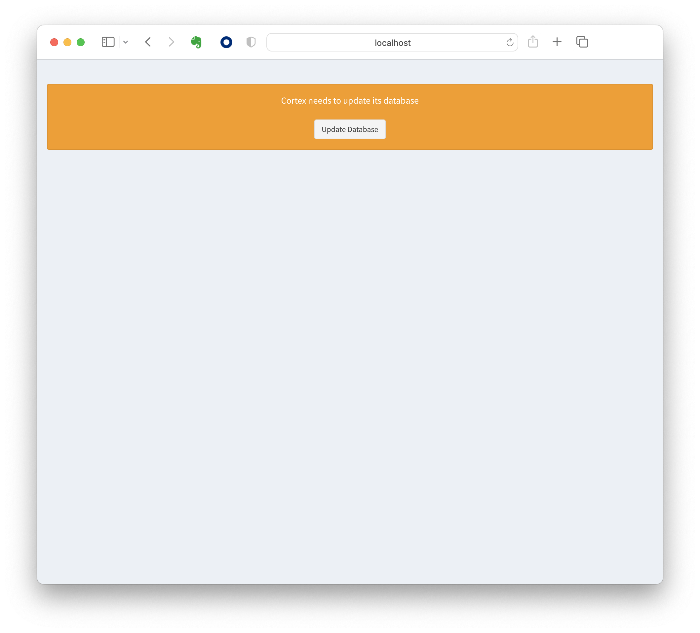
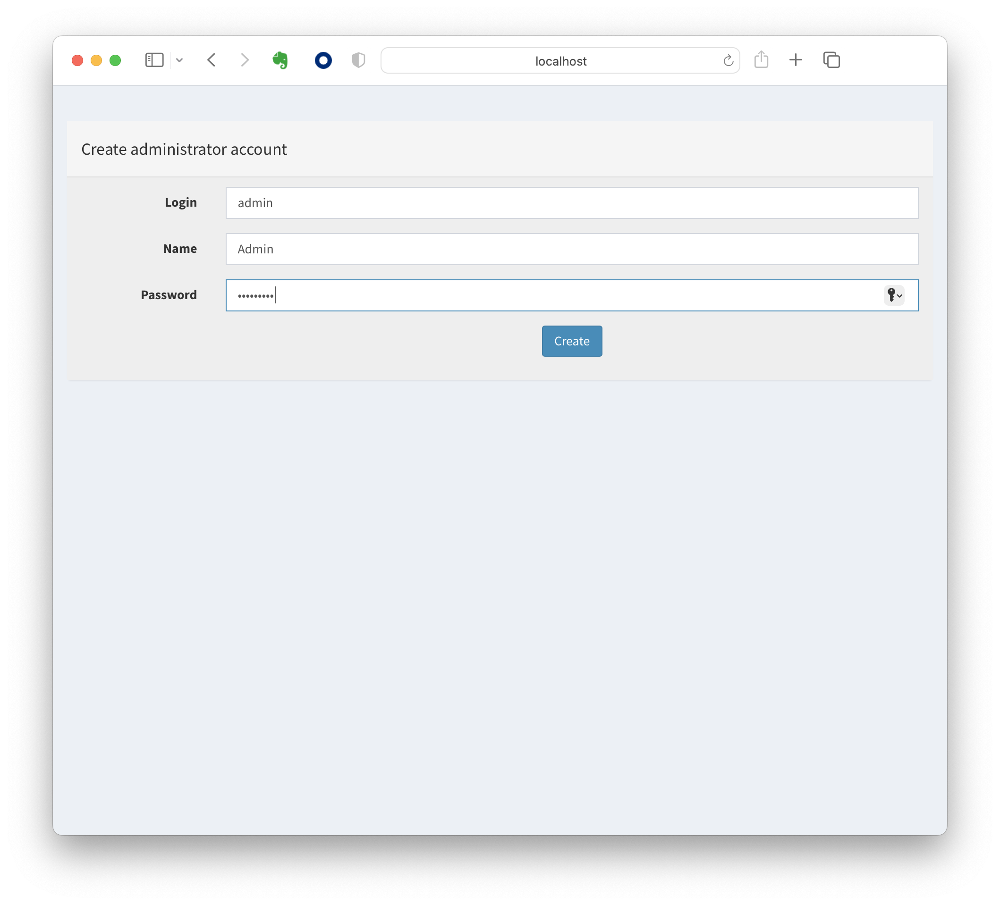
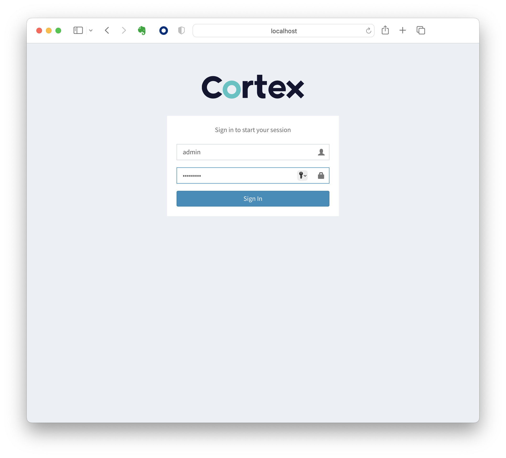
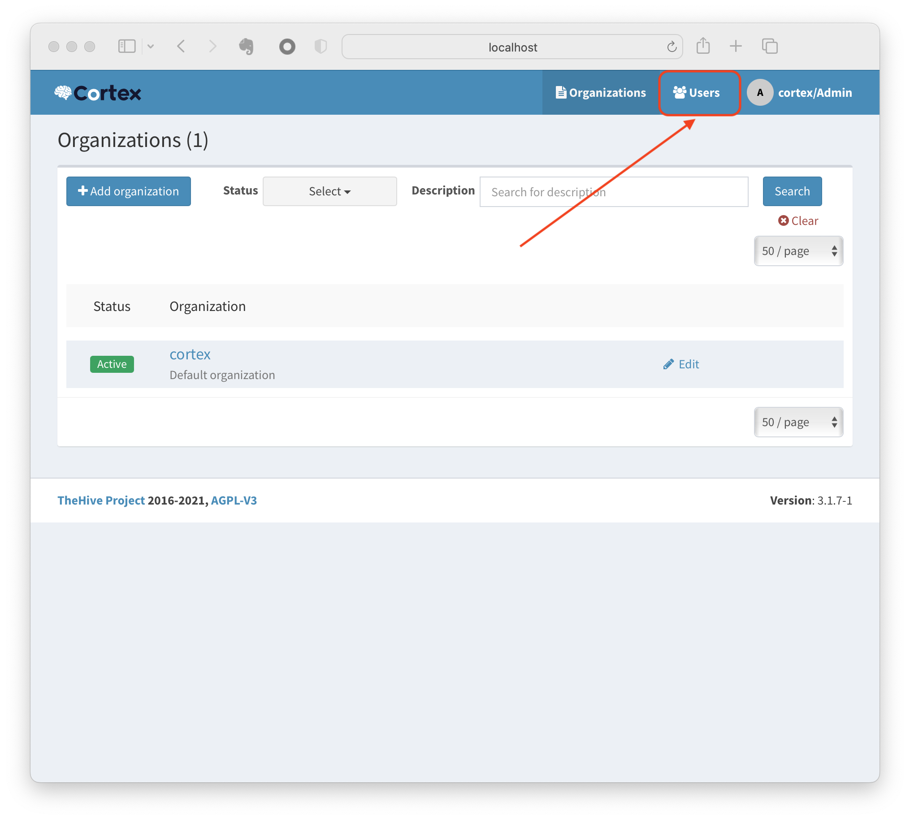
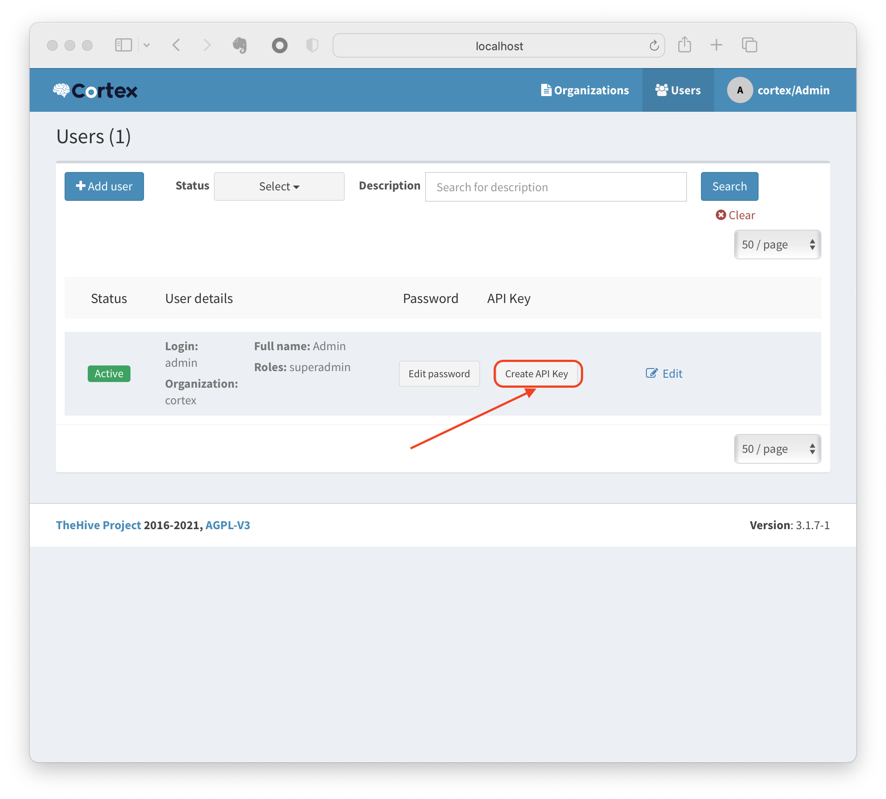
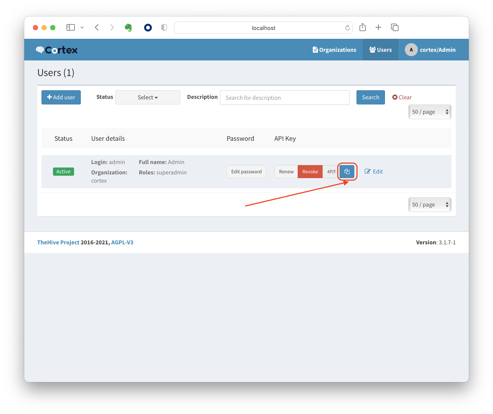

# The Hive and Cortex

## Important note

Make sure you disable zScaler to avoid SSL connections issues

## Steps

- Launch Cortex: 
  ```bash
   docker compose up -d elasticsearch cortex
  ```

- Initialize the underlying DB by opening in a browser: `http://localhost:9001`

- Update Database:



- Create the initial superadmin user:



- Login as superadmin:



- Select the "Users" tab:



- Create the API key for the superadmin:



- Copy the API key to the clipboard



- Open a terminal and start the Cortex configuration:
  ```bash
  ./setup.sh <pasted API key>
  ```

- Launch theHIve: 
  ```bash
  docker compose up -d thehive
  ```

- Wait one minute ( theHive is starting up)

- Login as superadmin *( admin / secret )*

- Check the Cortex integration ( should be green )


## References

https://chinyati.medium.com/the-hive-cortex-through-docker-installation-e50cbadb6cb0
https://github.com/chinyati/Article-Resources

